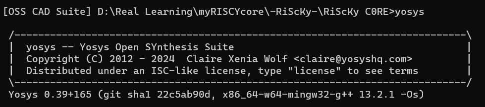
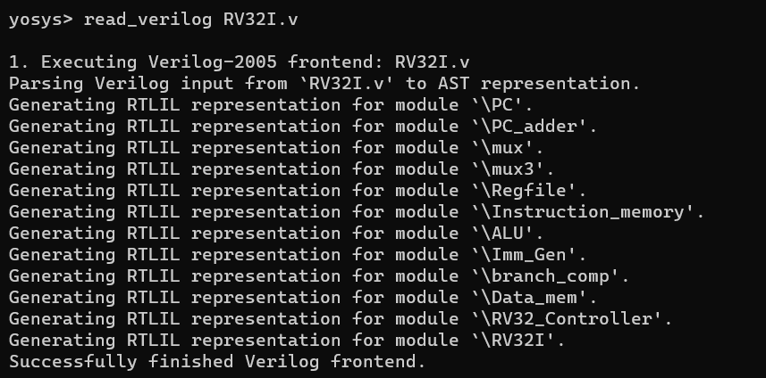
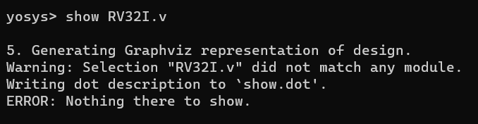

# RV32I core design

    
## Datapath   


## Objectives
- [x] Study RV32I Instruction Set architecture.
- [x] Design Datapth for single Cycle RV32I processor. (verilog).
- [x] Design Controller.
- [x] Design GUI for interfacing with data memory, registers and instruction hex files.
- [ ] Implement 5 stage pipeline of the processor (in progress).

## Supported Instructions (RV32I base instruction set)
* [x] add,sub,sll,slt,sltu,xor,srl,sra,or,and
* [x] addi,slti,sltiu,xori,ori,andi,slli,srli,srai
* [x] lb,lh,lw,lbu,lhu
* [x] sb,sh,sw
* [x] beq,bne,blt,bge,bltu,bgeu
* [ ] lui,auipc,jal,jalr
* [ ] fence,ecall,ebreak 
  
## Tech stack
* Iverilog
* Gtkwave
* Verilog HDL
* Python
* Git/Github
* VS Code
  
## Controller Design


## GUI for Registers & Data Memory 

### Problem
* The registers [x0 to x31] in RV32 ISA are loaded with data to be operated upon. This is the internal memory of the Processor.
* For testing or simulation, these registers were required to be manually entered and initiated in the Verilog code which was a tedious task.

### Solution
* I have developed a Python based Graphical user interface and changed the way the register files are loaded and initialized in the verilog code.
* The verilog code now uses the $readmemh function to read a reg_load.hex file into all 32 registers.
* The reg_load.hex file is generated by the GUI by default in the following manner:
```
@00000000
00000000
00000000
00000000
.
.
.
00000000
```
* This is the default file format.
* The @00000000 shows the starting address of the instructions.
* The next line is the data to be entered into the x0 register, the 2nd line is entered in the x1 register and so on...
* When the python GUI is run, you get a window popup as follows: 
* 
* The register configuration can be done from this terminal, and the saved file should be in the main directory where all the verilog modules of the core are loacted.
* The name of the file should always be "reg_load.hex" since that is programmed in the verilog file for registers.
* The file generated when 2 -> x2 and 3-> x3 is as follows 
```
@00000000
00000000
00000000
00000002
00000003
00000000
00000000
``` 

# Step by step implementation and progress.
* Module files were written.
* Top file is completed.
* Instantiating PC and PC_adder.
* 
* Instructions are properly read out of the instructions.hex file.
  
The test code is as follows for the add instruction datapath test.
Instructions: 
```
add x5,x1,x2 # add contents of reg x1 and x2, store result x5
add x5,x3,x5 # add contents of reg x3 and x5, store result x5
add x5,x4,x5 # add contents of reg x4 and x5, store result x5
```
Machine code

```
0x002082B3
0x005182B3
0x005202B3
```
Inside instructions.hex 
```
@00000000
002082B3
005182B3
005202B3
```

* 
* The Add istruction works well, only that Data is not being written into the register, since WE is off.
* 
* After adding WE, this is resolved.
* 
* added controller(with decoder functionality embedded directly)
* 
* added sub instruction capability as well
  
|PC	  | Machine Code  | 	Basic Code	| Original Code   |
| --- | ------------- | --------------  | --------------- |
|0x0  |	0x002082B3    |	add x5 x1 x2    |	add x5,x1,x2  |
|0x4  |	0x005182B3    |	add x5 x3 x5    |	add x5,x3,x5  |
|0x8  |	0x005202B3    |	add x5 x4 x5    |	add x5,x4,x5  |
|0xc  |	0x401282B3    |	sub x5 x5 x1    |	sub x5,x5,x1  |
|0x10 |	0x403282B3    |	sub x5 x5 x3    |	sub x5,x5,x3  |
|0x14 |	0x404282B3    |	sub x5 x5 x4    |	sub x5,x5,x4  |

* 
* Now moving on to other R type instructions of RV32I
* using funct3 to add all those instructions support. Changes will have to be made to ALU and Controller modules.
* Thats done. R type instructions are now supported on my core(sra left).
  
# Immediate datapath testing

## addi
The program executed:
```
PC	Machine Code	Basic Code	      Original Code
0x0	0x00310533	    add x10 x2 x3	  add x10, x2 ,x3
0x4	0x40250533	    sub x10 x10 x2	  sub x10, x10 ,x2
0x8	0x00A50513	    addi x10 x10 10	  addi x10,x10,+10
0xc	0xFF650513	    addi x10 x10 -10  addi x10,x10,-10

Register configuration:

x2 = 2
x3 = 3

```


## slti
* Test program for this instuction.
```
PC	  Machine Code	Basic Code	     Original Code
0x0	  0x00310533	add x10 x2 x3	 add x10, x2 ,x3
0x4	  0x40250533	sub x10 x10 x2	 sub x10, x10 ,x2
0x8	  0x00A50513	addi x10 x10 10	 addi x10,x10,+10
0xc	  0xFF650513	addi x10 x10 -10 addi x10,x10,-10
0x10  0x00052093	slti x1 x10 0	 slti x1,x10, 0
0x14  0x00A52113	slti x2 x10 10	 slti x2,x10, 10
```
* 
  
## andi and ori
```
PC	Machine Code	Basic Code	    Original Code
0x0	0x003172B3	    and x5 x2 x3	and x5,x2,x3
0x4	0x00316333	    or x6 x2 x3	or  x6,x2,x3
0x8	0x00A17293	    andi x5 x2 10	andi x5,x2,10
0xc	0x00A16313	    ori x6 x2 10	ori x6,x2,10
```
```
Register configuration:

x2 = 2
x3 = 3
```
* 
## slli


# Test for LW instruction
```
PC	Machine Code	Basic Code	    Original Code
0x0	0x0073A303	    lw x6 7(x7)	    lw x6, 7(x7)
0x4	0x00030313	    addi x6 x6 0	addi x6,x6,0
```


## explanaition
```
lw x6, 7(x7)
```
* The instruction wants to read data memory.
* Address of data memory to read = [data of register x7 + immediate(7 in this case)]. = 3 + 7 = 10;
* Note: data memory position 7 was loaded with value 3.
* Now the register x6 is loaded with the value from data memories 10th position. (in this case x10 = 0xE).
* The addi,x6,x6,0 is used to check value stored in x6, which is correctly found as E.
* Thus lw is verified.
* similarly tests for :
* lh x6, 7(x7) 
* 
* lb x6, 7(x7)
* 
* Test for lbu,lhu
```	
PC	Machine Code	Basic Code	    Original Code
0x0	0x0073D303	    lhu x6 7(x7)	lhu x6, 7(x7)
0x4	0x00030313	    addi x6 x6 0	addi x6,x6,0
0x8	0x0073C403	    lbu x8 7(x7)	lbu x8,7(x7)
0xc	0x00040413	    addi x8 x8 0	addi x8,x8,0
```


# Store instructions test.

register configuration.
5 -> x14
4 -> x2
```
PC	Machine Code	Basic Code	    Original Code
0x0	0x00E12423	    sw x14 8(x2)	sw x14, 8(x2)     # data in x14 to be stored in data memory. The address at which it is stored = [(data from x2) + (immediate 8)]. ie. 5 stored in Data mem location 12.
0x4	0x00812603	    lw x12 8(x2)	lw x12,8(x2)      # loads data from data memory posn 12 into register x12.
0x8	0x00060613	    addi x12 x12 0	addi x12,x12,0    # adds data in x12 with zero and stores in x12 (only done to see this on gtkwave).
```


# Yosys, Graphviz

* install [yosys](https://github.com/YosysHQ/yosys) 
* windows exe of [yosys](https://github.com/YosysHQ/oss-cad-suite-build/releases/download/2024-04-08/oss-cad-suite-windows-x64-20240408.exe)

## Using Yosys

* press start in windows
* open command prompt
* go to the directory where your verilog files are stored
* ```<extracted_location>\oss-cad-suite\environment.bat```
* This will open up OSS CAD Suite
* ```yosys```
* This opens yosys
* 
* Now enter the command ```read_verilog RV32I.v```
* 
* Next enter ```show RV32I```
* 
* Install [Graphviz](https://gitlab.com/api/v4/projects/4207231/packages/generic/graphviz-releases/10.0.1/windows_10_cmake_Release_graphviz-install-10.0.1-win64.exe)
* Open another command prompt terminal and navigate to the same directory
* Enter the command ```dot -Tpng show.dot > output.png```
* This will make a png image of your design with the name output.png
* 