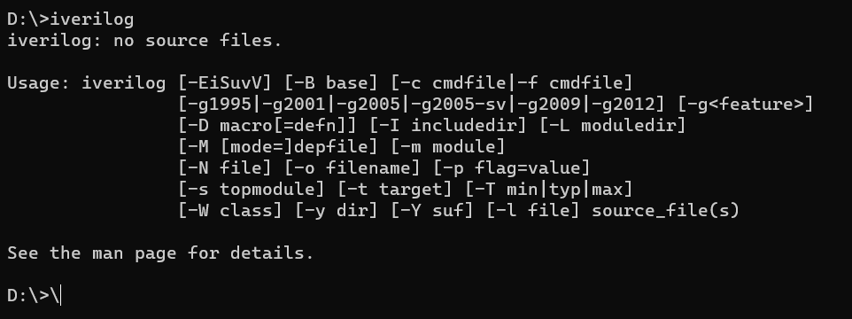
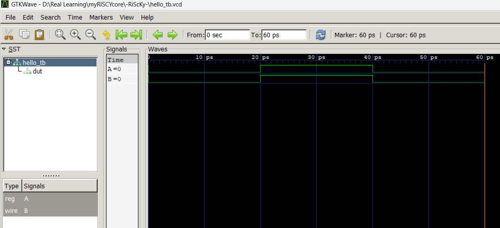

First download Icarus verilog.
``https://bleyer.org/icarus/``

to check installation, open command promt and write iverilog.



Write the verilog codes and test benches.

To view the waveform on gtk wave, follow the steps below...

```iverilog -o hello_tb.vvp hello_tb.v```

```vvp hello_tb.vvp```

VCD info: dumpfile hello_tb.vcd opened for output.
Test complete

```gtkwave```
 
