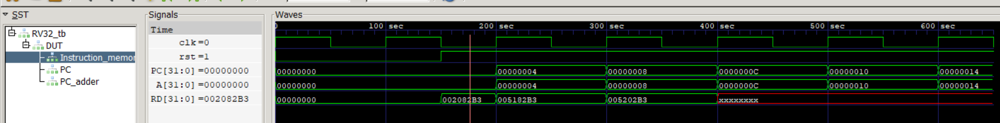
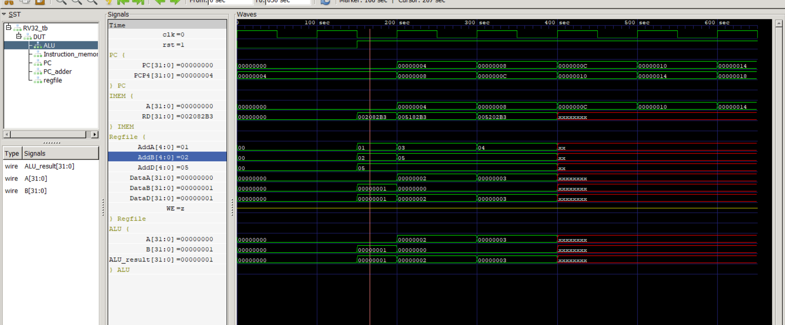
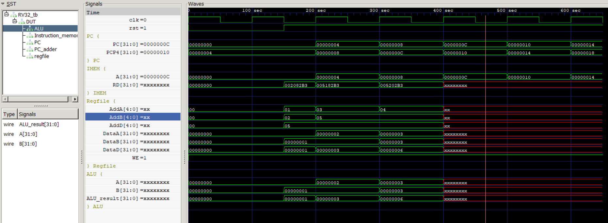
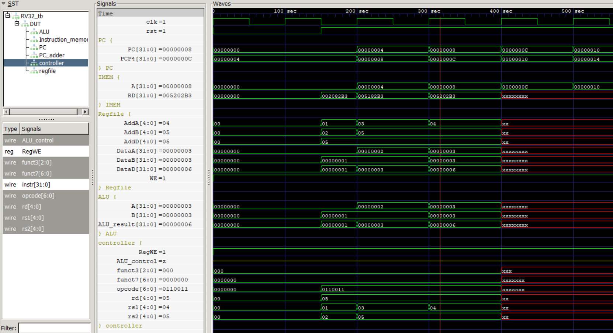
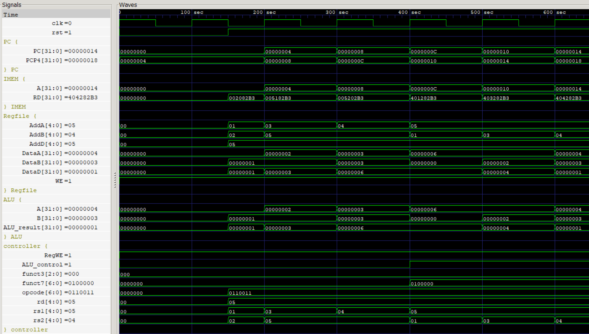
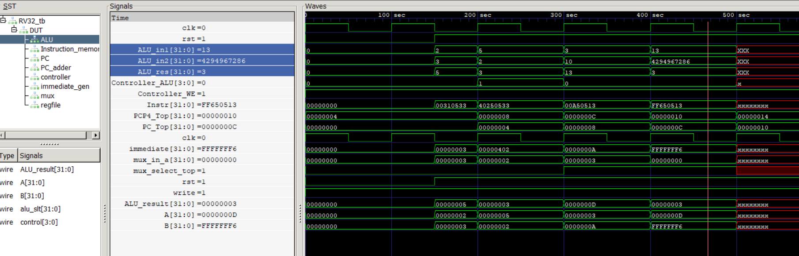

# Single Cycle RV32I Datapth Design

## Step by step implementation and progress.
* Module files were written.
* Top file is completed.
* Instantiating PC and PC_adder.
* 
* Instructions are properly read out of the instructions.hex file.
  
The test code is as follows for the add instruction datapath test.
Instructions: 
```
add x5,x1,x2 # add contents of reg x1 and x2, store result x5
add x5,x3,x5 # add contents of reg x3 and x5, store result x5
add x5,x4,x5 # add contents of reg x4 and x5, store result x5
```
Machine code

```
0x002082B3
0x005182B3
0x005202B3
```
Inside instructions.hex 
```
@00000000
002082B3
005182B3
005202B3
```

* 
* The Add istruction works well, only that Data is not being written into the register, since WE is off.
* 
* After adding WE, this is resolved.
* 
* added controller(with decoder functionality embedded directly)
* 
* added sub instruction capability as well
  
|PC	  | Machine Code  | 	Basic Code	| Original Code   |
| --- | ------------- | --------------  | --------------- |
|0x0  |	0x002082B3    |	add x5 x1 x2    |	add x5,x1,x2  |
|0x4  |	0x005182B3    |	add x5 x3 x5    |	add x5,x3,x5  |
|0x8  |	0x005202B3    |	add x5 x4 x5    |	add x5,x4,x5  |
|0xc  |	0x401282B3    |	sub x5 x5 x1    |	sub x5,x5,x1  |
|0x10 |	0x403282B3    |	sub x5 x5 x3    |	sub x5,x5,x3  |
|0x14 |	0x404282B3    |	sub x5 x5 x4    |	sub x5,x5,x4  |

* 
* Now moving on to other R type instructions of RV32I
* using funct3 to add all those instructions support. Changes will have to be made to ALU and Controller modules.
* Thats done. R type instructions are now supported on my core(sra left).
  
## Immediate datapath testing
The program executed:
```
PC	Machine Code	Basic Code	      Original Code
0x0	0x00310533	    add x10 x2 x3	  add x10, x2 ,x3
0x4	0x40250533	    sub x10 x10 x2	  sub x10, x10 ,x2
0x8	0x00A50513	    addi x10 x10 10	  addi x10,x10,+10
0xc	0xFF650513	    addi x10 x10 -10  addi x10,x10,-10

Register configuration:

x2 = 2
x3 = 3

```
